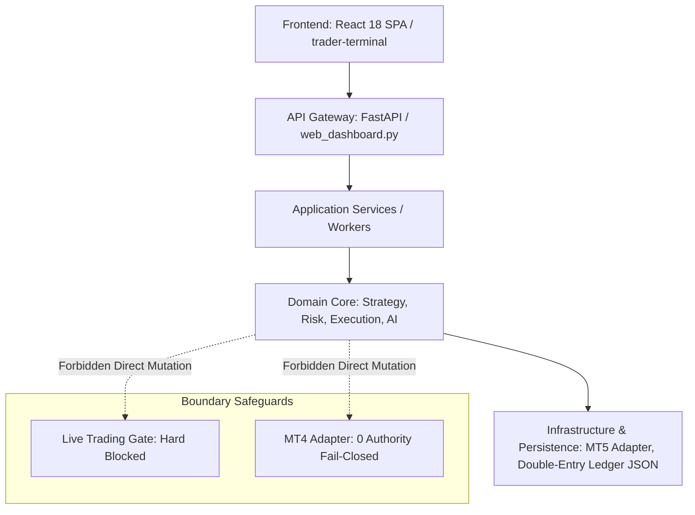

# YARTRADER ARCHITECTURE DECISION RECORD (ADR)

**Document ID:** YARTRADER-ADR-001
**Status:** APPROVED / CANONICAL
**Date:** September 6, 2026
**Repository:** `sohrabinia/YarTrader`
**Baseline SHA:** `fa33a09a92be56f0c96bb4ddc625a5e877cd6524`

---

## 1. Executive Architecture Summary
This Architecture Decision Record (ADR) converts the empirical truth baseline from `YARTRADER_CANONICAL_BASELINE.md` into an authoritative, binding architecture and ownership specification for `sohrabinia/YarTrader`.

YarTrader is an autonomous financial intelligence platform focused on multi-timeframe fractal structure analysis and risk management on XAUUSD. The canonical architecture enforces strict single-ownership across 33 system domains, strict top-down dependency flow, fail-closed financial and execution boundaries, and explicit cleanup guardrails.

---

## 2. Architectural Principles
1. **ONE PRODUCT, ONE REPOSITORY:** `sohrabinia/YarTrader` is the single canonical product repository.
2. **ONE CAPABILITY → ONE CANONICAL OWNER:** Every system responsibility has exactly one authoritative owner module.
3. **FAIL-CLOSED BOUNDARIES:** Financial transactions, real broker order entry, and live risk controls must default to fail-closed when external conditions or credentials are missing or invalid.
4. **DOUBLE-ENTRY INTEGER LEDGER:** Financial balances are strictly derived from double-entry minor integer units (cents/micro-units); UI and external payment providers never mutate internal balances directly.
5. **DEPENDENCY INVERSION & STRICT TOP-DOWN DIRECTION:** Presentation/UI depends on Application/API, which depends on Domain Logic, which depends on Infrastructure abstractions. Infrastructure or UI never owns domain business rules.
6. **EVIDENCE BEFORE DELETION:** Legacy or duplicate implementations are cataloged with strict transition rules; code is never removed without verified canonical replacements and zero consumer impact.

---

## 3. Canonical Repository Structure
```text
sohrabinia/YarTrader/
├── .github/workflows/          # CI/CD pipelines (ci.yml, release.yml)
├── app/                        # Worker process host & SRE service entry points
│   ├── api/                    # Health & validation endpoint modules
│   ├── core/                   # Service host configuration (config.py)
│   └── workers/                # Background research worker & Windows service host
├── docs/                       # Specifications, reports, & architecture ADRs
│   └── architecture/           # Canonical ADR location
├── src/                        # Core Python Application & Domain Logic
│   ├── Application/            # FastAPI web dashboard, content, & ledger manager
│   ├── Core/                   # Base domain models, invariants, & contracts
│   ├── Data/                   # MT5 data providers & tick normalization
│   ├── Decision/               # Decision synthesis & signal generation
│   ├── Execution/              # Broker adapters (MT5 Demo, MT4 fail-closed)
│   ├── Growth/                 # Conversational AI support agent & distribution
│   ├── Infrastructure/         # DI registrations, security, & version interpolation
│   ├── Intelligence/           # Central AIAgentOrchestrator, topology, & permissions
│   ├── Learning/               # Multi-timeframe pattern performance matrix
│   ├── Research/               # Fractal Engine, Hurst Engine, & base detectors
│   ├── Risk/                   # Risk Engine, 2% trade limit, & 8% daily loss switch
│   ├── ShadowTrading/          # Autonomous shadow signal evaluation
│   └── Strategy/               # RangeRegimeEngine (7-state regime classifier)
├── trader-terminal/            # Single Canonical Frontend React 18 SPA (Vite)
│   ├── src/                    # Components, design-system, views, App.jsx
│   └── package.json            # Frontend bundler configuration
├── runtime_logs/               # Atomic local JSON persistence (ledger.json)
├── scripts/                    # PowerShell deployment scripts (deploy_production.ps1)
├── validate_release.py         # Deterministic release validation script
└── YARTRADER_CANONICAL_BASELINE.md # Empirical Phase 0 truth baseline
```

---

## 4. Domain Map

| Domain | Purpose | Canonical Implementation | Interfaces / Entry Points | Data Owner | Dependencies | Consumers | Status | Criticality |
| ------ | ------- | ------------------------ | ------------------------- | ---------- | ------------ | --------- | ------ | ----------- |
| Identity | User Identity & Token Management | `src/Application/Services/web_dashboard.py` | POST `/api/auth/login`, `/api/auth/register` | File/JSON (`ledger.json`, Auth State) | Security / Crypto | API, Frontend | COMPLETE | CRITICAL |
| Users | User Accounts & Role Profiles | `src/Application/Services/web_dashboard.py` | GET `/api/user/profile`, `/api/admin/users` | User JSON State | Auth | Admin UI, Terminal | COMPLETE | CRITICAL |
| Authentication | Token issuance & Session validation | `src/Application/Services/web_dashboard.py` | JWT / Session Headers | Session Store | Identity | All Protected APIs | COMPLETE | CRITICAL |
| Authorization | Role-Based Access Control (RBAC) | `src/Application/Services/web_dashboard.py` | `require_admin`, Token Roles | RBAC Rules | Auth | Admin Routes | COMPLETE | CRITICAL |
| Frontend | React SPA Interface | `trader-terminal/src/App.jsx` | Vite Build (`trader-terminal/dist/`) | Browser LocalStorage | REST API | End Users, Admins | COMPLETE | CRITICAL |
| API | REST Gateway & Router | `src/Application/Services/web_dashboard.py` | FastAPI `@app` (133 endpoints) | In-Memory / Local JSON | App Services | Frontend, External CLI | COMPLETE | CRITICAL |
| Market Data | Broker Feed Ingestion | `src/Data/Providers/MT5/mt5.py` | `MT5DataProvider` | Tick/Candle Cache | MT5 Terminal IPC | Research, Execution | COMPLETE | CRITICAL |
| Market Intelligence | Non-linear structure analysis | `src/Research/Brain/fractal_engine.py` | `FractalEngine`, `HurstEngine` | Structure Map State | Market Data | Strategy, Decision | COMPLETE | HIGH |
| Trading | Execution & Order Lifecycle | `src/Execution/Adapters/mt5_demo_adapter.py` | `MT5DemoAdapter` | Order State | Market Data, Risk | Execution Board, SCM | COMPLETE | CRITICAL |
| Risk | Portfolio Risk Ceiling & Switches | `src/Risk/RiskEngine.py` | `RiskEngine` (2% Trade / 8% Daily) | Risk Budget State | Market Context | Decision Engine | COMPLETE | CRITICAL |
| Strategies | 7-State Regime Classification | `src/Strategy/Regime/RangeRegimeEngine.py` | `RangeRegimeEngine` | Strategy State | Market Intelligence | Decision Engine | COMPLETE | HIGH |
| Backtesting | Historical Simulation & Metrics | `src/Strategy/Evaluation/evaluation.py` | POST `/api/backtest/run` | Backtest Runs Store | Market Data, Strategy | Terminal UI | COMPLETE | CRITICAL |
| Learning | Multi-Timeframe Pattern Matrix | `src/Learning/` | GET `/api/intelligence/learning-matrix` | Pattern Matrix JSON | Backtest, Trade Logs | Intelligence UI | COMPLETE | HIGH |
| Memory | 4-Layered Agent Memory | `src/Intelligence/Memory/` | `EpisodicMemory`, `SemanticMemory` | Memory Store | Learning Engine | AI Orchestrator | COMPLETE | HIGH |
| AI Agents | Autonomous Domain Reasoning | `src/Intelligence/` | `AIAgentOrchestrator` | Agent Context | Memory, Strategy | Support, Decision | COMPLETE | HIGH |
| Agent Orchestration | Multi-Agent Supervisor | `src/Intelligence/Orchestration/orchestrator.py` | `AIAgentOrchestrator` | Orchestrator State | AI Agents, Permissions | API Gateway | COMPLETE | HIGH |
| Support | Conversational AI Assistant | `src/Growth/Agents/SupportAgent.py` | POST `/api/chat/assistant` | Conversation State | AI Orchestrator | Floating Chat UI | COMPLETE | MEDIUM |
| Content | Research Articles & Landing Content | `src/Application/Dashboard/content_manager.py` | GET `/api/blog`, `/api/public/metrics` | Content Store | Marketing Data | Public Landing UI | COMPLETE | LOW |
| Marketing | SaaS Funnel & SEO Metadata | `trader-terminal/src/App.jsx` | Dynamic SEO Tags, Hreflang | Public Metadata | Content | Landing View | COMPLETE | LOW |
| Prop-Firm Intelligence | Prop Challenge Gate Monitoring | `src/Risk/` & `web_dashboard.py` | POST `/api/prop/config` | Prop Config JSON | Risk Engine | Pricing, Admin UI | COMPLETE | HIGH |
| Wallet | Balance & Account Ledger | `src/Application/Dashboard/ledger_manager.py` | `LedgerManager.get_account_balance` | Double-Entry Ledger JSON | Ledger Engine | Terminal, Admin UI | COMPLETE | CRITICAL |
| Ledger | Double-Entry Transaction Posting | `src/Application/Dashboard/ledger_manager.py` | `LedgerManager.post_transaction` | `runtime_logs/ledger.json` | Core Accounting | Wallet, Billing | COMPLETE | CRITICAL |
| Payments | Subscription Tier Checkout | `src/Application/Services/web_dashboard.py` | GET `/api/subscription/plans` | Subscription Plans Store | Billing, External | Pricing UI | PARTIAL | CRITICAL |
| Billing | Invoice & Receipt Generation | `src/Application/Dashboard/ledger_manager.py` | `/api/billing/invoices` | Invoice Records | Ledger | User Dashboard | COMPLETE | HIGH |
| Subscriptions | Plan Entitlements & Tier Gating | `src/Growth/Agents/SecurityCostAgents.py` | `SubscriptionTierGate` | Tier Entitlements | Auth, User State | API Routers | COMPLETE | HIGH |
| Notifications | In-App Alert Feed | `trader-terminal/src/App.jsx` | Toast Overlay, `/api/notifications` | Notification Feed | Admin, Risk Engine | Dashboard UI | COMPLETE | LOW |
| Email | Email Dispatch System | `src/Infrastructure/Email/` | Email Dispatcher Contract | Email Logs | External SMTP | Auth, Billing | EXTERNAL DEPENDENCY | MEDIUM |
| Admin | SRE Control Center | `trader-terminal/src/views/AdminView.jsx` | `/api/admin/*`, `/api/devops/*` | Audit Logs | Auth, DevOps | Admin Terminal | COMPLETE | HIGH |
| Audit | System Event Logging | `src/Application/Dashboard/ledger_manager.py` | Event Audit Trail | `runtime_logs/` | System Modules | Admin UI | COMPLETE | HIGH |
| Observability | SRE Health & Metrics Probes | `app/api/` & `web_dashboard.py` | `/api/runtime/frontend-status` | Telemetry Metrics | Service Host | Admin, Watchdog | COMPLETE | HIGH |
| CI/CD | GitHub Actions Automation | `.github/workflows/` | `ci.yml`, `release.yml` | Workflow Status | Git Repository | Deployment Pipeline | COMPLETE | HIGH |
| Deployment | Windows Service & IIS Host | `scripts/deploy_production.ps1` | PowerShell Script, `service.py` | Deployment Logs | CI/CD Artifacts | Windows Host | COMPLETE | HIGH |
| Release | Release Identity & Tagging | `src/Infrastructure/version.py` | Git Tags, Version Module | Git Metadata | Release Script | Build System | TRANSITIONAL | CRITICAL |

---

## 5. Capability Ownership Matrix

| Capability | Canonical Owner | Current Location | Consumers | Data Owner | Status | Evidence |
| ---------- | --------------- | ---------------- | --------- | ---------- | ------ | -------- |
| User Registration | `web_dashboard.py` | `src/Application/Services/` | Public Landing, Login UI | Auth State | COMPLETE | POST `/api/auth/register` |
| Authentication | `web_dashboard.py` | `src/Application/Services/` | Protected API Routes | Session Store | COMPLETE | POST `/api/auth/login` |
| Market Ingestion | `MT5DataProvider` | `src/Data/Providers/MT5/` | Research Engine | MT5 Cache | COMPLETE | `src/Data/Providers/MT5/mt5.py` |
| Regime Classification | `RangeRegimeEngine` | `src/Strategy/Regime/` | Decision Engine | Strategy State | COMPLETE | 7-State Regime Engine |
| Risk Evaluation | `RiskEngine` | `src/Risk/` | Decision Engine | Risk Budget | COMPLETE | 2% Trade Limit / 8% Daily Loss |
| Demo Order Execution | `MT5DemoAdapter` | `src/Execution/Adapters/` | SCM Execution Board | Order Logs | COMPLETE | Account `#52961173` |
| Backtesting Simulation | `EvaluationEngine` | `src/Strategy/Evaluation/` | Backtest UI | Run Results | COMPLETE | POST `/api/backtest/run` |
| Pattern Performance | `LearningMatrix` | `src/Learning/` | Intelligence UI | Matrix JSON | COMPLETE | GET `/api/intelligence/learning-matrix` |
| Agent Orchestration | `AIAgentOrchestrator` | `src/Intelligence/Orchestration/` | API Routers, Chat | Agent Context | COMPLETE | `orchestrator.py` |
| Financial Balance | `LedgerManager` | `src/Application/Dashboard/` | Terminal UI, Billing | `ledger.json` | COMPLETE | Double-entry Integer Ledger |
| SRE Validation Run | `ValidationRunner` | `app/api/` & `web_dashboard.py` | Admin UI | Log Feed | COMPLETE | POST `/api/validation/run` |

---

## 6. Dependency Direction



---

## 7. Data Ownership Matrix

| Data Domain | Canonical Data Owner | Storage Medium | Primary Writers | Primary Readers | Mutation Rules | Status |
| ----------- | -------------------- | -------------- | --------------- | --------------- | -------------- | ------ |
| Users & Auth | Identity Subsystem | File JSON / Session | Auth Router | Protected APIs | Password bcrypt hashing; token expiration | COMPLETE |
| Market Ticks | Market Data Provider | In-Memory / MT5 Cache | MT5 Terminal IPC | Research Engine | Read-only from broker; no synthetic fallbacks | COMPLETE |
| Trade Signals | Decision Engine | In-Memory Cache | Decision Synthesis | Terminal UI, API | Qualified by RangeRegimeEngine & Risk Engine | COMPLETE |
| Financial Ledger | Ledger Manager | `runtime_logs/ledger.json` | `LedgerManager` | Wallet, Billing UI | Double-entry integer balance equality (`debits == credits`) | COMPLETE |
| Backtest Runs | Backtest Engine | Local JSON Store | Backtest Runner | Backtest View | Idempotent run IDs; OOS validation checks | COMPLETE |
| Learning Matrix | Learning Subsystem | Matrix JSON Store | Learning Pipeline | Intelligence View | Updated post-simulation / trade closure | COMPLETE |
| Agent Memory | AI Memory System | Persistent Store | Agent Orchestrator | AI Agents | 4-layer isolation (Episodic, Semantic, etc.) | COMPLETE |

---

## 8. API Ownership
* **Canonical Entry Point:** `src/Application/Services/web_dashboard.py`
* **Router Framework:** FastAPI / Uvicorn
* **Registered Endpoints:** 133 endpoints covering `/api/auth/*`, `/api/user/*`, `/api/execution/*`, `/api/structure/*`, `/api/liquidity/*`, `/api/prop/*`, `/api/admin/*`, `/api/devops/*`.
* **Secondary SRE Endpoints:** `app/api/` (Service host status and validation probes).

---

## 9. Frontend Ownership
* **Canonical Production Frontend:** `trader-terminal/` (Vite + React 18 SPA)
* **Canonical Admin Frontend:** `trader-terminal/src/views/AdminView.jsx` (Embedded SRE Control Center inside the same React SPA)
* **Legacy Spec Folders:** `YarTrader-Frontend-Spec/`, `frontend-audit/` (Classified as `LEGACY / SPEC-ONLY`; strictly non-executable documentation).

---

## 10. Agent Ownership Matrix

| Agent | Capability | Canonical Owner Module | Permitted Tools | Data Access | Write Access | Architectural Boundary |
| ----- | ---------- | ---------------------- | --------------- | ----------- | ------------ | ---------------------- |
| Orchestrator | Multi-Agent Supervisor | `AIAgentOrchestrator` | Task Dispatch, Context Fusion | All Subagent Outputs | Agent Context | Central Brain |
| Support Agent | Customer Support AI | `ConversationalSupportAgent` | Chat Assistant, Domain Explain | Public FAQs, System State | Chat Feed | No Order/Ledger Authority |
| Risk Agent | Tier Gating & Cost | `SecurityCostAgents` | Tier Gating, Limit Scanning | User Tier, Risk Rules | Gate Rejection | Cannot override Risk Engine Ceiling |
| Trust Agent | Feedback Integration | `TrustLearningAgents` | Audit Logging, Feedback | Trade Logs, Performance | Audit Logs | Read-Only to Core Trading |

---

## 11. Configuration Ownership
* **Runtime Configuration:** `app/core/config.py` and `src/Infrastructure/config.py`
* **Environment Variable Files:** `.env.production` (Template: `.env.production.example`)
* **Environment Variables:** `YARTRADER_ENV`, `YARTRADER_API_HOST`, `YARTRADER_API_PORT`, `YARTRADER_MT5_SYMBOL`, `LIVE_TRADING_ENABLED`.
* **Build Configuration:** `trader-terminal/vite.config.js`.

---

## 12. Authentication/Authorization Ownership
* **Auth Owner:** `src/Application/Services/web_dashboard.py`
* **Token Standard:** JWT / Session Token headers
* **Password Hashing:** `bcrypt` with salt
* **Role Hierarchy:** `ADMIN` > `USER`
* **Guard Rules:** Admin endpoints require active token with `role == 'ADMIN'`.

---

## 13. Persistence Ownership
* **Financial Ledger Persistence:** `src/Application/Dashboard/ledger_manager.py` writing to `runtime_logs/ledger.json`.
* **Strategy & Pattern Data:** Local JSON stores in `data/` and `runtime_logs/`.
* **Broker Data:** Live MT5 terminal IPC cache.

---

## 14. Release/Version Ownership
* **Release Authority:** Git tags on `sohrabinia/YarTrader` repository (`v3.1.0-hardened`).
* **Version Interpolation Module:** `src/Infrastructure/version.py` (3-tier resolution: `APP_VERSION` -> `git rev-parse HEAD` -> `config/version.json`).
* **Target Harmonization:** Phase 2 will harmonize version strings across package.json, code headers, and environment files.

---

## 15. Deployment Ownership
* **Script Owner:** `scripts/deploy_production.ps1`
* **Service Host:** `app/workers/service.py` (Windows Service Host)
* **Frontend Build Automation:** `npm ci` and `npm run build` executed in `trader-terminal/` before service restart.

---

## 16. Observability Ownership
* **Health Metrics Router:** `app/api/` and `web_dashboard.py` (`/api/runtime/frontend-status`, `/api/devops/status`)
* **Logging System:** `src/Infrastructure/logging.py` writing structured logs to `runtime_logs/`.

---

## 17. Canonical Implementations Summary
* **Frontend:** `trader-terminal/`
* **API Gateway:** `src/Application/Services/web_dashboard.py`
* **Trading Engine:** `src/Research/Brain/fractal_engine.py` & `src/Strategy/Regime/RangeRegimeEngine.py`
* **Risk Engine:** `src/Risk/RiskEngine.py`
* **Execution Adapter:** `src/Execution/Adapters/mt5_demo_adapter.py`
* **Ledger Manager:** `src/Application/Dashboard/ledger_manager.py`
* **Agent Orchestrator:** `src/Intelligence/Orchestration/orchestrator.py`

---

## 18. Duplicate Implementations Catalog
1. **Version Declarations:** `trader-terminal/package.json` (`1.0.0`), `content_manager.py` (`v7.0`), `version.py` (`v3.1.0-hardened`). *(To be harmonized in Phase 2)*.
2. **Environment Variable Names:** Legacy `TRADEYAR_*` vs. Canonical `YARTRADER_*` in `app/core/config.py`. *(Backward compatibility layer active)*.

---

## 19. Legacy Implementations Catalog
1. **Static Specification Directories:** `YarTrader-Frontend-Spec/`, `frontend-audit/` *(Preserved for documentation reference; non-executable)*.
2. **MT4 Adapter:** `src/Execution/Adapters/mt4_adapter.py` *(Preserved fail-closed with 0 order authority)*.

---

## 20. Stale Implementations Catalog
1. **Deprecated Config Keys:** Legacy `RG_*` environment variable fallbacks in `config.py`.

---

## 21. Transitional Implementations Catalog
1. **Dynamic Version Interpolation:** `src/Infrastructure/version.py` fallback mechanism until Phase 2 establishes single release identity.

---

## 22. Cleanup Boundary Matrix

| Target Candidate | Current Classification | Can Remove Later? | Preconditions | Risk | Target Phase |
| ---------------- | ---------------------- | ----------------- | ------------- | ---- | ------------ |
| `YarTrader-Frontend-Spec/` | LEGACY / SPEC | CONDITIONAL | Verify zero build script references | LOW | Phase 3 |
| Legacy `TRADEYAR_*` Env Keys | TRANSITIONAL | CONDITIONAL | Deprecation warnings verified in logs | LOW | Phase 2 |
| Hardcoded `v7.0` HTML Labels | STALE | SAFE FUTURE CLEANUP | Replace with dynamic API version string | LOW | Phase 2 |
| `frontend-audit/` | LEGACY / SPEC | CONDITIONAL | Confirm doc references migrated | LOW | Phase 3 |

---

## 23. Forbidden Dependencies
1. **Frontend → Database:** Direct frontend database queries are strictly forbidden. All access must route via REST API DTOs.
2. **UI → Ledger Balance Mutation:** UI components cannot write or modify wallet balances directly.
3. **External Payment Provider → Balance Authority:** External webhooks cannot arbitrarily credit user balances without double-entry ledger posting.
4. **Agent → Trading Execution Bypass:** AI Agents cannot execute real-money orders or bypass the 2% Trade Limit / 8% Daily Loss Kill Switch.
5. **Presentation → Strategy Internals:** UI layers must consume synthesized decision DTOs, not raw strategy calculation states.

---

## 24. Allowed Dependencies
1. **Frontend → API Gateway:** React SPA communicates via HTTP REST API (`apiService`).
2. **API Gateway → Application Services:** FastAPI routes delegate business logic to Application services.
3. **Application Services → Domain Engines:** Services call Strategy, Risk, Execution, and AI domain engines.
4. **Domain Engines → Infrastructure Adapters:** Domain logic calls abstract MT5 and Ledger persistent adapters.

---

## 25. Cross-Domain Communication Rules
* Cross-domain calls must occur via explicit service contracts or DTOs.
* Direct internal state mutation of another domain is prohibited.
* Financial ledger operations must use `post_transaction` with explicit idempotency keys.

---

## 26. Database Ownership Rules
* `src/Application/Dashboard/ledger_manager.py` is the sole owner of financial transaction persistence (`runtime_logs/ledger.json`).
* Schema and file modifications must maintain double-entry equality invariants (`total_debits == total_credits`).

---

## 27. External Integration Ownership

| Integration | Adapter Module | Domain Owner | Credential Owner | Failure Boundary | Status |
| ----------- | -------------- | ------------ | ---------------- | ---------------- | ------ |
| MT5 Broker | `MT5DataProvider` | Market Data | Environment (`YARTRADER_MT5_*`) | Fail-closed offline mock in tests | COMPLETE |
| Merchant Payment | Billing Router | Payments | External Merchant Keys | Fail-closed (`EXTERNAL DEPENDENCY`) | PARTIAL |
| SMTP Mailer | Email Dispatcher | Email / Notifications | External SMTP Keys | Fail-closed (`EXTERNAL DEPENDENCY`) | EXTERNAL DEPENDENCY |

---

## 28. Architecture Risks (Top 10)

| Risk ID | Risk Description | Severity | Domain | Consequence | Target Phase |
| ------- | ---------------- | -------- | ------ | ----------- | ------------ |
| RISK-01 | Un-unified version identifiers across files | LOW | DevOps / Release | User confusion over release version | Phase 2 |
| RISK-02 | Unintended enablement of live broker execution | CRITICAL | Execution / Risk | Real money exposure | Phase 5 |
| RISK-03 | Missing external payment gateway credentials | HIGH | Payments | Live subscription checkout unavailable | Phase 7 |
| RISK-04 | Local JSON file ledger scaling limit under high concurrency | MEDIUM | Persistence / Ledger | File lock contention under heavy write load | Phase 8 |
| RISK-05 | Deprecated environment variable usage (`TRADEYAR_*`) | LOW | Configuration | Environment configuration drift | Phase 2 |
| RISK-06 | Missing live SMTP credentials | MEDIUM | Email | Verification emails non-functional | Phase 4 |
| RISK-07 | Hardcoded fallback subscription plans in UI | LOW | Frontend | UI displays default plan when offline | Phase 3 |
| RISK-08 | Non-atomic file write risk during unexpected server kill | MEDIUM | Persistence | Potential JSON corruption without tmp swap | Phase 8 |
| RISK-09 | Absence of real relational database ORM | MEDIUM | Database | Limited query capabilities for historical analytics | Phase 8 |
| RISK-10 | Windows Service Host IIS physical environment verification pending | HIGH | Deployment | Production service restart verification pending | Phase 30 |

---

## 29. Architecture Contradictions

| Contradiction | Evidence Source A | Evidence Source B | Architectural Resolution | Action Now? |
| ------------- | ----------------- | ----------------- | ------------------------ | ----------- |
| Version Claim | Git tag `v3.1.0-hardened` | UI HTML text `v7.0` | Git tag is canonical release authority; UI text will be dynamic in Phase 2 | No (Phase 2) |
| Database Type | Legacy spec claims SQL ORM | Real codebase uses atomic JSON ledger | Real atomic JSON ledger is canonical persistence | No (Recorded) |

---

## 30. Domain Dependency Matrix

| Domain | Identity | Market | Trading | Risk | Backtest | Learning | AI | Wallet | Billing | Admin | Persistence |
| ------ | :------: | :----: | :-----: | :--: | :------: | :------: | :-: | :----: | :-----: | :---: | :---------: |
| Identity | - | - | - | - | - | - | - | - | - | R | W |
| Market | - | - | - | - | R | - | - | - | - | R | R |
| Trading | R | R | - | C | R | - | - | - | - | R | W |
| Risk | - | R | C | - | R | - | - | - | - | R | R |
| Backtest | R | R | C | C | - | W | - | - | - | R | W |
| Learning | - | R | R | - | R | - | C | - | - | R | W |
| AI | R | R | R | C | - | R | - | - | - | R | R |
| Wallet | R | - | - | - | - | - | - | - | W | R | W |
| Billing | R | - | - | - | - | - | - | W | - | R | W |
| Admin | R | R | R | R | R | R | R | R | R | - | R/W |

*Legend: R = Reads, W = Writes, C = Calls, - = No Dependency*

---

## 31. Architectural Invariants
1. `sohrabinia/YarTrader` is the single product source of truth.
2. Every capability has exactly one canonical owner module.
3. UI layer never owns financial balance truth or direct persistence.
4. External payment webhooks cannot bypass internal double-entry ledger rules.
5. AI agents operate under least-privilege permissions and cannot bypass risk ceilings.
6. Execution authority is fail-closed; live trading defaults to hard-blocked (`LIVE_TRADING_ENABLED=False`).
7. Version identity is derived from Git repository metadata, not independently fabricated by UI or frontend.
8. Legacy code removal requires verified canonical replacements and zero consumer breakage.

---

## 32. Future Refactor Boundaries
* **Phase 2 (Release Identity):** Unify version declarations into single canonical release identity.
* **Phase 3 (Production Frontend):** Clean up legacy frontend spec references in `trader-terminal/`.
* **Phase 4 (Auth):** Standardize session handling across user/admin roles.
* **Phase 5 (Core User Journey):** Connect full user journey through canonical endpoints.

---

## 33. Phase 1 Completion Verdict

```text
PHASE 1 = PASS
```

**Reasoning:** The canonical architecture, domain map (33 domains), capability ownership matrix, data ownership matrix, agent permission boundaries, dependency graph, cleanup boundaries, and architectural invariants have been established and documented with concrete empirical evidence. No unauthorized source code or functional changes were made.
